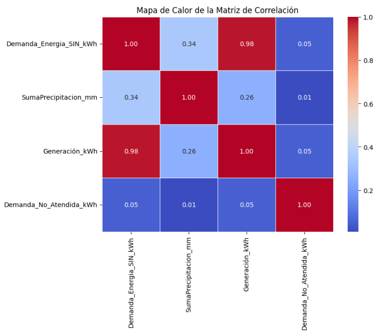
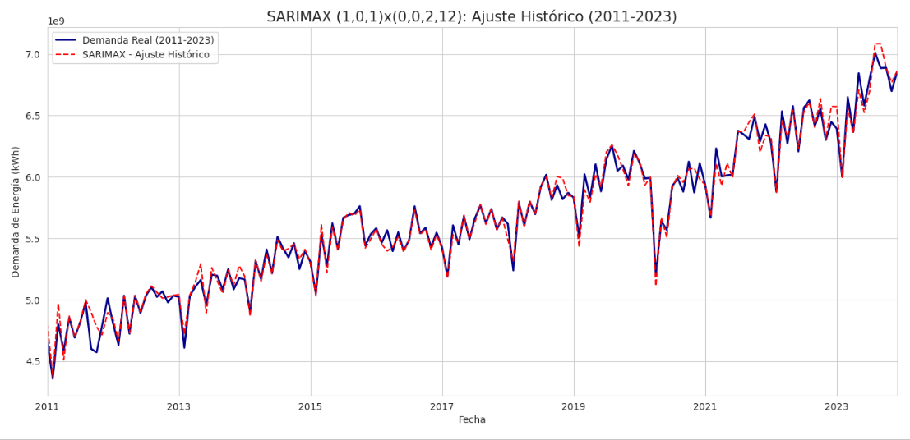
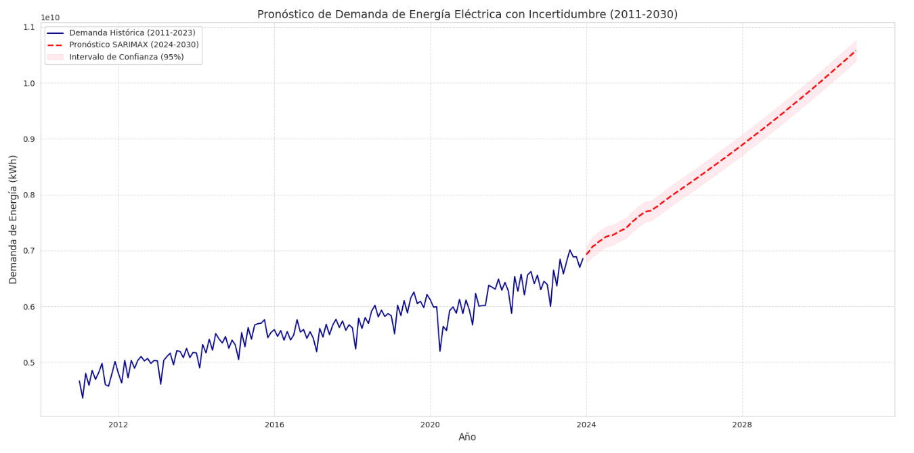

# Análisis comparativo de modelos ARIMA, Random Forest y Gradient Boosting para la predicción de la demanda del sistema interconectado nacional colombiano (2024-2030).

## Contexto y Problemática: ¿Por qué este proyecto?
El Sistema Interconectado Nacional (SIN) de Colombia tiene una característica que lo hace único y vulnerable: **el 70% de su generación de energía depende del agua** (hidroeléctricas). Esto significa que nuestra seguridad energética está atada a los fenómenos climáticos como El Niño y La Niña.

Una predicción inexacta de cuánta energía va a consumir el país puede resultar en dos escenarios catastróficos:
1. **Déficit:** Apagones y racionamientos severos por falta de planificación.
2. **Sobrecostos:** Inversiones ineficientes o compras de energía de emergencia a precios exorbitantes.

**El objetivo de este proyecto** es resolver esta incertidumbre creando una herramienta de predicción de alta precisión mensual hasta el año 2030. Para ello, se puso a prueba la econometría clásica (SARIMAX) contra algoritmos modernos de Machine Learning (Random Forest, Gradient Boosting), integrando variables críticas como la **Precipitación** y la **Generación histórica**.

---

## Análisis Exploratorio y Multivariable
Antes de predecir, fue crucial entender la relación entre las variables. Mediante una Matriz de Correlación de Pearson, se confirmó matemáticamente la hipótesis del negocio: la demanda de energía tiene una dependencia directa de los ciclos de precipitación y una correlación casi perfecta con la generación.

---

## Metodología y Modelado
Se descartó la validación aleatoria tradicional para evitar fugas de datos (*data leakage*) y se utilizó un *Time-Based Split* (Entrenamiento: 2010-2021 | Prueba: 2022-2023). 

El reto principal para los modelos de Inteligencia Artificial (Random Forest) fue su naturaleza "agnóstica al tiempo", requiriendo una compleja ingeniería de características (creación de rezagos o *Lags*). Por el contrario, el modelo **SARIMAX (1, 0, 1) x (0, 0, 2, 12)** capturó la estructura estacional de manera nativa.

---

## Resultados: El Ganador
El escrutinio en los datos de prueba demostró una superioridad técnica abrumadora del modelo econométrico sobre las alternativas de "caja negra" en el modelado de tendencias fuertes:

| Modelo | MAPE (%) | R² | Robustez de Tendencia |
| :--- | :---: | :---: | :---: |
| **SARIMAX** | **1.37%** | **0.992** | Excelente |
| Random Forest | 3.43% | Negativo | Deficiente |
| Gradient Boosting | 3.04% | 0.095 | Deficiente |

---

## Proyección Final (2024 - 2030)
Aplicando el modelo ganador, se proyecta una continuación robusta de la tendencia lineal positiva. El hallazgo más relevante para la planificación estatal es que la demanda mensual **superará la barrera de los 10,000 GWh para finales de la década**, exigiendo a la UPME y a los agentes del mercado una expansión proporcional de la capacidad instalada.

*(Nota: La línea suavizada representa el valor esperado bajo un escenario de crecimiento lineal de la generación, mientras que la sombra rosa gestiona el riesgo indicando el intervalo de confianza del 95%).*

## Conclusión General
Este proyecto demuestra de manera concluyente que, para modelar la compleja dinámica del Sistema Interconectado Nacional (SIN) de Colombia, la especialización econométrica supera a los enfoques genéricos de Machine Learning. Al integrar formalmente variables exógenas críticas como la precipitación y la generación, el modelo SARIMAX implementado logró proyectar la demanda energética hasta 2030 con una precisión (MAPE de 1.37%). Más que un ejercicio comparativo de algoritmos, este repositorio entrega una herramienta validada estadísticamente y de alta fidelidad, indispensable para mitigar la vulnerabilidad climática del sistema y respaldar la toma de decisiones estratégicas en la planificación de la infraestructura energética del país.

## Autor
* **Iván Darío Rojas Galvis** - *Especialización en Ciencia de Datos - Universidad Nacional Abierta y a Distancia (UNAD)*
